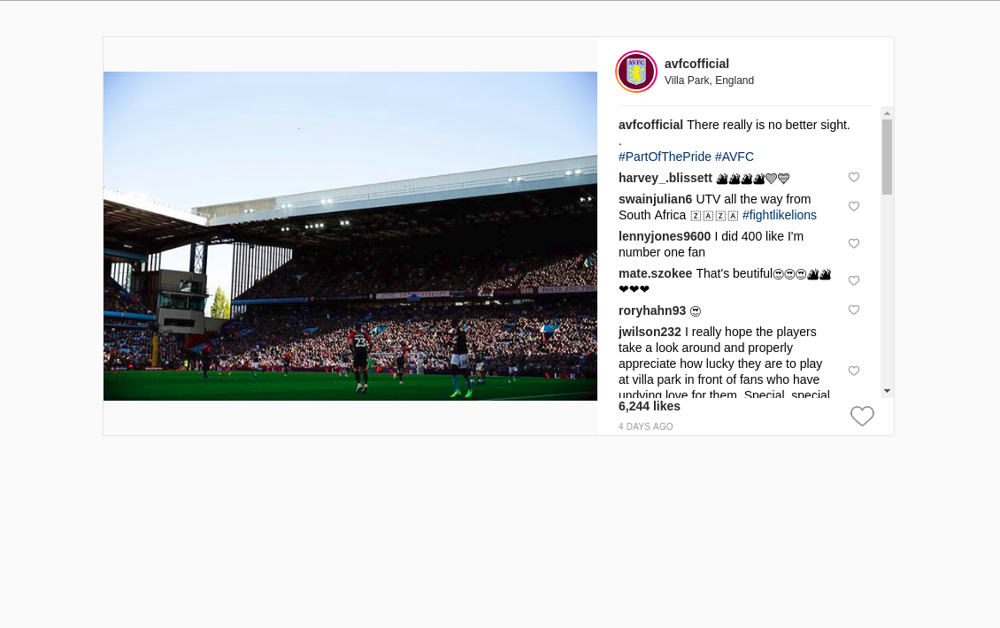

# IG Post

An IG post created using React. Pulls in data like images, user information, comments, and has the ability to like.

## Running the app

1. Run `docker-compose up`
2. That's it. The app will be running on port `3000` of your docker machine. 
